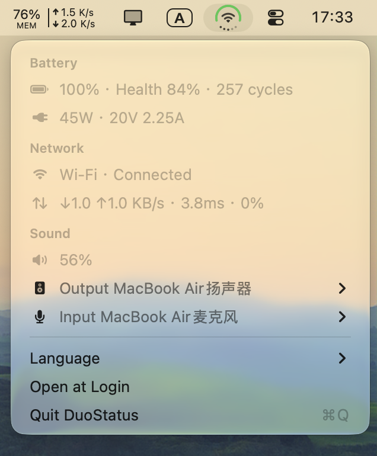

# DuoStatus

The iPhone Duo rolls Wi-Fi, cell signal and battery into a single circle instead of a row of icons. I thought that was a neat idea, so I brought it to the
Mac with Claude.

It's a menu bar app: mixes battery, network and volume in one badge, with the basics in the dropdown. 

I like it, and hopefully someone else will too. 🎉



## Install

```bash
./build.sh --install
```

macOS 14+, built with Xcode 27. Needs no system permissions.
English and 简体中文, following the system language unless you pick one.
