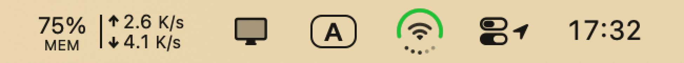

# DuoStatus

The iPhone Duo rolls Wi-Fi, cell signal and battery into a single circle instead of a row of icons. I thought that was a neat idea, so I brought it to the
Mac with Claude.

It's a menu bar app: mixes battery, network and volume in one badge, with the basics in the dropdown. 

I like it, and hopefully someone else will too. 🎉




No Location, no Accessibility, no Full Disk Access — no usage-description keys in the
bundle, no entitlements in the binary.

## Notes

- macOS 27 hides menu item images unless you set `preferredImageVisibility = .visible`.
- Timers don't fire while a menu is open; they need `RunLoop.main.add(timer, forMode: .common)`.
- `NSStatusBar.thickness` reports 22pt, but the button grows with the image — 32pt still isn't clipped.
- Location permission gates the Wi-Fi *name* only. RSSI, noise, channel and transmit rate read fine without it.
- Battery health isn't in IORegistry. `system_profiler SPPowerDataType` has it, in 0.09s.
- ICMP works without root: `socket(AF_INET, SOCK_DGRAM, IPPROTO_ICMP)`.
- Round line caps extend `stroke/2` past the endpoint, so arc gaps are `(gap + stroke) / radius`.
- Drawing changes are checked by rendering all 1442 states into one image and diffing the hash.

## Install

Download the [latest release](https://github.com/zhenweiding-dev/duostatus/releases/latest),
open the `.dmg`, drag **DuoStatus** into **Applications**.

The app isn't notarized, so macOS blocks the first launch. **System Settings → Privacy &
Security** → **Open Anyway**.

Or build it:

```bash
./build.sh --install     # build and install to /Applications
./build.sh --dmg         # build the disk image
```

macOS 14+, universal. Building needs Xcode 27.
English and 简体中文, following the system language unless you pick one.
